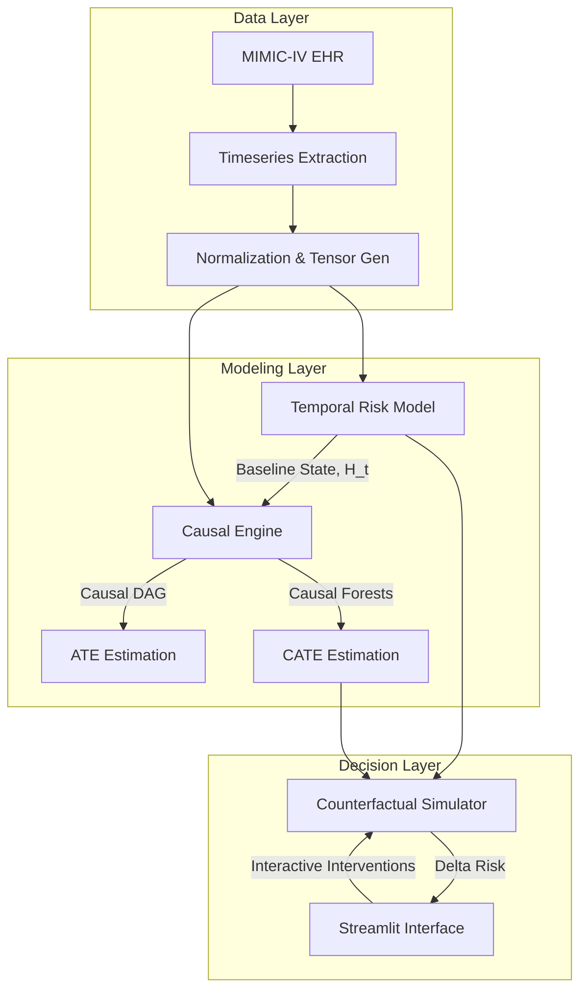

<div align="center">
  <h1>ORION: Causal AI for ICU Intervention Planning</h1>
  <p><i>A Counterfactual Decision-Support System for Critical Care</i></p>

  <p>
    <a href="https://pytorch.org"></a>
    <a href="https://microsoft.github.io/EconML/"></a>
    <a href="https://microsoft.github.io/dowhy/"></a>
    <a href="https://streamlit.io"></a>
  </p>

  <h3>
    🌐 <b>Live in the Real World:</b> <a href="https://siddhantchandorkar752-orion-ai.streamlit.app/">👉 Click Here to View the Interactive Dashboard</a>
  </h3>
</div>

> ⚠️ **Disclaimer: Research Prototype — Not for Clinical Use.**  
> This system is an academic decision-support framework designed for machine learning research. It is not validated for real clinical deployment.

---

## 🔬 Executive Summary

Standard risk-scoring systems in the ICU (like SOFA or APACHE) are **predictive**: they forecast mortality but offer no actionable guidance. **ORION** is **prescriptive and counterfactual**.

ORION answers the critical question:
> *"If we administer a 500ml IV Fluid Bolus to this specific patient right now, what is the mathematically expected change in their mortality risk over the next 6 hours?"*

To achieve this, ORION bridges deep sequence modeling (for complex temporal representation learning) with double machine learning (for unbiased causal effect estimation).

### Key Differentiators
1. **Temporal Perception:** Bidirectional LSTM with attention pooling handles 24-hour multivariate vitals/labs sequences to model baseline risk trajectories.
2. **Causal Reasoning:** Integrates `DoWhy` for formal Directed Acyclic Graph (DAG) construction and `EconML` (Causal Forests) for estimating heterogeneous treatment effects (CATE).
3. **Rigorous Refutation:** Includes a dedicated evaluation suite for placebo tests, random common cause tests, and data subset refutations to ensure causal estimates are defensible.

---

## 🧩 System Architecture



---

## 🚀 Quickstart & Installation

ORION is built to be run fully locally. 

### 1. Environment Setup
It is highly recommended to use a virtual environment.
```bash
# Clone the repository
git clone https://github.com/siddhantchandorkar752-ai/ORION.git
cd ORION

# Create and activate virtual environment
python -m venv venv
# On Windows:
venv\Scripts\activate
# On Linux/Mac:
source venv/bin/activate

# Install dependencies
pip install --upgrade pip
pip install -r requirements.txt
```

### 2. Live Cloud Demo Note
If you are deploying this project directly to **Streamlit Community Cloud**, simply connect the repository and set the Main file path to `ui/app.py`. 
*Note:* The cloud deployment is configured to gracefully fallback to randomized temporal weights and zeroed causal adjustments if the `models/` directory is empty. This guarantees the UI functions correctly for demonstration purposes without requiring a large MIMIC-IV data download to the cloud server.

---

## 🛠️ Reproducing the Pipeline Locally

For full local training, you must process the MIMIC-IV data and train the models sequentially.

### Phase 1: Data Processing
We provide support for the [MIMIC-IV Demo dataset](https://physionet.org/content/mimic-iv-demo/2.2/) which requires no credentialing.
```bash
# Extract cohorts and vitals
python data/extract_mimic.py --mimic_dir data/raw/mimic-iv-demo/2.2 --out_dir data/processed

# Preprocess into PyTorch tensors and DataFrames
python data/preprocess.py --ts_dir data/processed/timeseries --out_dir data/processed/tensors
```

### Phase 2: Model Training
```bash
# Train the Temporal LSTM Risk Model
python models/temporal/train.py --tensor_dir data/processed/tensors --out_dir models/temporal

# Train the Causal Engine (DoWhy + EconML)
python models/causal/causal_engine.py --processed_dir data/processed --out_dir models/causal
```

### Phase 3: Evaluation
Defensibility is critical in Causal AI. Run our evaluation suite to generate ROC-AUC metrics and rigorous Causal Refutation scorecards.
```bash
python evaluation/predictive.py
python evaluation/causal_refutation.py
```

### Phase 4: Launch the Interface
Boot up the Streamlit dashboard to interact with the Counterfactual Simulator.
```bash
streamlit run ui/app.py
```

---

## 📊 Evaluation Rigor & Methodology

Unlike standard ML projects, ORION relies on **Falsification/Refutation**. 
The `causal_refutation.py` script automatically subjects the Causal Forest models to three rigorous tests:

1. **Placebo Treatment Test:** Replaces the intervention variable with a randomly generated placebo. *Expected Result:* The Average Treatment Effect (ATE) should drop to 0.
2. **Random Common Cause Test:** Injects a spurious independent variable into the dataset. *Expected Result:* The original ATE should remain stable.
3. **Data Subset Test:** Re-estimates the effect on a randomly drawn 80% subset of the data. *Expected Result:* Estimates should remain stable with minimal variance.

ORION evaluates its own causal claims and explicitly rejects interventions that fail these refutation tests.

---

## 📁 Repository Structure

```text
ORION/
├── data/
│   ├── extract_mimic.py       # SQL-like joining & patient cohort selection
│   ├── preprocess.py          # Imputation, scaling, and sequence windowing
│   ├── raw/                   # (Ignored) Raw MIMIC CSVs
│   └── processed/             # (Ignored) Intermediate processing artifacts
├── models/
│   ├── temporal/
│   │   ├── risk_model.py      # PyTorch Bi-LSTM with Attention
│   │   └── train.py           # PyTorch training loop + Focal Loss
│   └── causal/
│       └── causal_engine.py   # DoWhy DAGs + EconML CausalForestDML
├── simulator/
│   └── counterfactual.py      # Core simulation engine linking LSTM & CATE
├── evaluation/
│   ├── predictive.py          # Brier Score, ROC-AUC, PR-AUC, Calibration
│   └── causal_refutation.py   # Causal validation scorecard
├── ui/
│   └── app.py                 # Streamlit frontend
├── requirements.txt           # Dependency locking
└── README.md                  # Project documentation
```

---

## 📄 License & Attribution
- Data Source: [MIMIC-IV (PhysioNet)](https://physionet.org/content/mimiciv/). Johnson, A., et al. 
- License: MIT License (Codebase). Data usage is strictly bound by the PhysioNet Credentialed Data Use Agreement.
- Author: Siddhant Chandorkar
